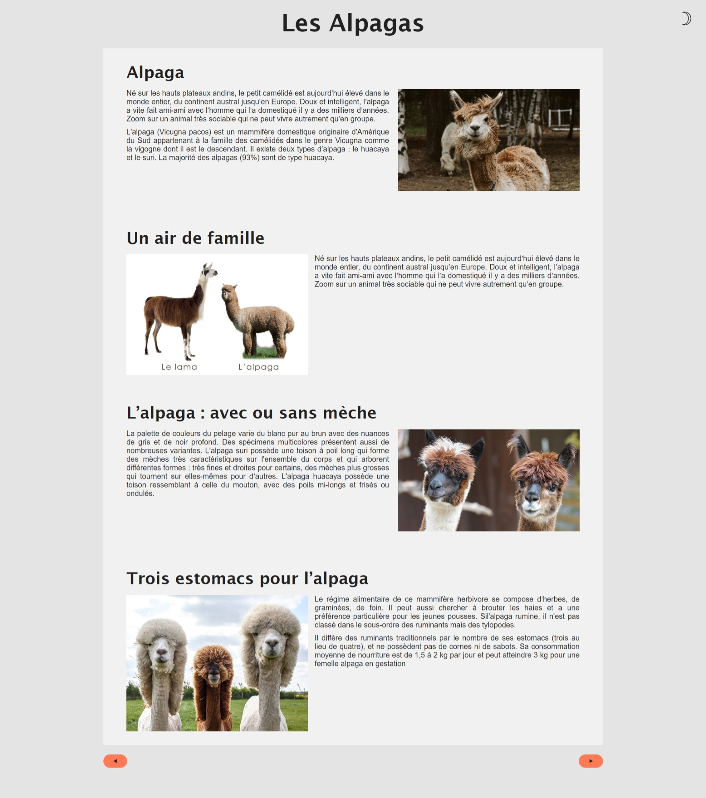
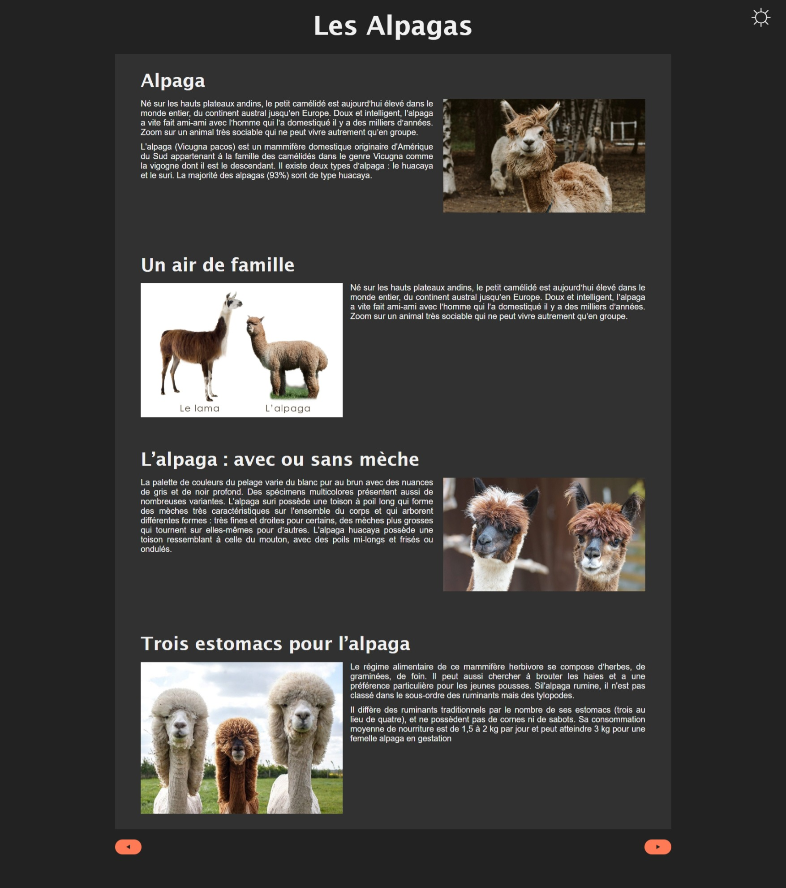

  
  

# 🌚 Dark Mode Alpaga :full_moon:
______________________________________
💻 Here is a small exercise carried out as part of my personal learning in web junior developer within BeCode :school_satchel:

☺️ I created a dark fashion version inspired by one of my favorite animals: Alpacas 🦙😅

# Look 🔎

    <h2>Day Mode</h2>
    
    <h2>Night Mode</h2>
    
  

